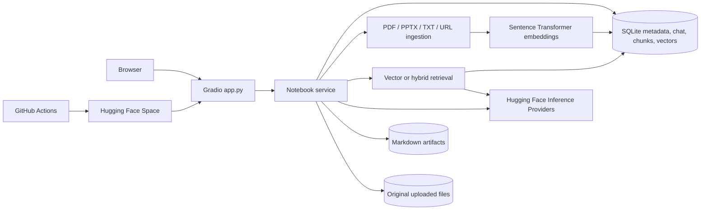

# Architecture

## Modules and data flow

| Component | Responsibility |
| --- | --- |
| `app.py` | Gradio controls, notebook selection, uploads, chat, citations, artifact viewing and download, user-facing errors |
| `notebooklm/service.py` | Coordinates notebook operations, ingestion, retrieval, chat persistence, and artifact generation |
| `notebooklm/storage.py` | SQLite schema and notebook-scoped reads/writes for notebooks, extracted source text, chunks, embeddings, chat, and artifact records |
| `notebooklm/ingest.py` | Text extraction for supported files and URLs, chunking, and source metadata |
| `notebooklm/retrieval.py` | Embedding and notebook-scoped vector/hybrid retrieval |
| `notebooklm/generation.py` | Hugging Face chat requests and formatting for cited answers, reports, and quizzes |
| `scripts/evaluate.py` | Repeated retrieval comparison on a selected notebook and question set |

1. **Ingestion:** the user selects a notebook and supplies a file or URL. The service extracts text, divides it into chunks, embeds each chunk, then stores source metadata, text, and vectors under that notebook ID. Original uploaded files are saved under that notebook's source directory. Empty or unreadable sources return an error.
2. **Chat:** a question is embedded and compared against chunks belonging only to the active notebook. The selected chunks, with source references, go through Hugging Face Inference Providers to the configured chat model. The response and conversation messages are stored under the notebook ID and displayed with citations.
3. **Artifacts:** the service samples enabled source chunks across sources (up to 60 chunks and 40,000 context characters), asks the same chat model for a report or quiz, writes the resulting Markdown under the configured data directory, and records it for later viewing or download. The context cap means very large notebooks may not be fully represented in one artifact.
4. **Notebook changes:** rename updates the notebook record; delete removes its related content. Switching notebooks changes the ID used for all queries and UI history.

## Storage and boundaries

`NOTEBOOKLM_DATA_DIR` defaults to `data/` locally; if `/data` already exists, the app uses that instead. `NOTEBOOKLM_DB_PATH` can override the SQLite file path. SQLite keeps notebook IDs, metadata, extracted source text, chunks, embeddings, conversation, and artifact references. Original uploads live in `sources/<notebook-id>/`, and generated Markdown lives in `artifacts/<notebook-id>/`, both beside the SQLite file. Sources uploaded before file retention was added remain available through their extracted text but have no saved original file. A notebook ID is carried through reads and writes so content is kept separate by notebook. The application is a single-user class project: it does not authenticate visitors or isolate people from each other on a public Space.

The SQLite vectors are compared in process, so this design avoids an external vector service. That works for small course-project collections; loading and comparing many vectors will become slower as the corpus grows. Hybrid retrieval combines semantic similarity with lexical matching to help with exact terms. The [evaluation protocol](EVALUATION.md) measures that tradeoff with real questions.

## Deployment

GitHub `main` pushes trigger `.github/workflows/deploy.yml`. The workflow uses the Hugging Face `hub-sync` action, with `HF_TOKEN` and `HF_SPACE_REPO_ID` stored as GitHub Actions secrets, to copy the repository to a Gradio Space. The Space builds its Python environment from `requirements.txt`, reads the README YAML for its entry point, and reads `HF_INFERENCE_TOKEN` from a Space secret. GitHub's deployment token and the Space's inference token have different purposes and are configured separately.

Local files survive local app restarts. Default Hugging Face Space disk is ephemeral, so Space data can be lost on rebuild or restart. A mounted Storage Bucket plus a matching `NOTEBOOKLM_DATA_DIR` gives durable runtime storage; otherwise the deployment is a demonstration environment.
