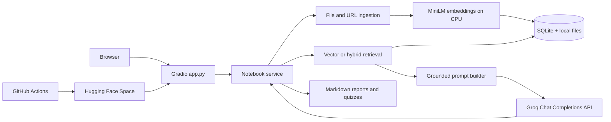

# Architecture

## System design



This split is deliberate. Hugging Face provides the required deployed application and hosts the public embedding model. Groq provides fast language generation through the student's existing free API key. The Space never needs a paid Hugging Face inference endpoint, and Groq credentials remain server-side.

## Module responsibilities

| Component | Responsibility |
| --- | --- |
| `app.py` | Gradio notebook manager, upload and URL controls, chat, citations, artifacts, retrieval comparison, and user-facing errors |
| `notebooklm/service.py` | Coordinates notebook operations, ingestion, retrieval, generation, chat persistence, and artifact files |
| `notebooklm/storage.py` | SQLite schema and notebook-scoped CRUD for notebooks, sources, chunks, embeddings, messages, and artifacts |
| `notebooklm/ingest.py` | Safe file/URL extraction, normalization, overlapping chunking, and source metadata |
| `notebooklm/retrieval.py` | MiniLM embeddings, exhaustive cosine vector search, and hybrid semantic/lexical rank fusion |
| `notebooklm/generation.py` | Source-context construction, Groq chat calls, provider error handling, and grounded deterministic artifacts |
| `scripts/evaluate.py` | Repeatable vector-versus-hybrid retrieval and optional generated-answer evaluation |
| `.github/workflows/deploy.yml` | Pull-request tests and tested `main` deployment to the Space |

## Data flow

1. **Ingestion:** the selected notebook ID and a supported source enter the service. Text is extracted, normalized, split into roughly 1,200-character chunks with 200-character overlap, and embedded with `all-MiniLM-L6-v2`. SQLite atomically stores the source, chunk metadata, and vectors. Uploaded originals are copied under `sources/<notebook-id>/`.
2. **Retrieval:** the question is embedded with the same model. Vector search computes cosine similarity across enabled chunks in the active notebook. Hybrid search fuses semantic rank with exact-term ranking. No chunk from another notebook is eligible.
3. **Generation:** the top three chunks are labeled `[S1]`, `[S2]`, and `[S3]` and limited to a 2,600-character context budget. The system prompt tells Groq to use only those excerpts, treat source content as data, refuse unsupported answers, and cite factual claims. The API key is read only from the server environment.
4. **Persistence:** the question, answer, citation metadata, and scores are stored under the notebook ID. Gradio renders the saved messages and source excerpts.
5. **Artifacts:** reports and quizzes select complete statements directly from enabled notebook chunks, retain source markers, save Markdown under `artifacts/<notebook-id>/`, and register the file in SQLite.

## Storage model

```text
NOTEBOOKLM_DATA_DIR/
├── notebooklm.db
├── sources/
│   └── <notebook-uuid>/
│       └── <source-uuid>.<extension>
└── artifacts/
    └── <notebook-uuid>/
        └── <kind>-<artifact-uuid>.md
```

Notebook and source IDs are UUIDs. SQL parameters are bound rather than interpolated, foreign keys cascade deletes, and user-controlled names are never used as filesystem path components. URL ingestion rejects credentials, non-HTTP schemes, private/local IP addresses, unsafe redirects, unsupported content types, compressed responses, excessive sizes, and long downloads.

SQLite vectors are intentionally compared in process. That removes an external vector database bill and is appropriate for the assignment's small notebooks. It will not scale like a managed vector database for large or highly concurrent corpora.

## Deployment and cost boundaries

GitHub pull requests run compilation and unit tests. A successful push to `main` then uses Hugging Face's `hub-sync` action to mirror repository files to the configured Gradio Space. Space settings and secrets are not stored in Git, so `GROQ_API_KEY` is not copied through GitHub Actions.

The free deployment uses a personal ZeroGPU Space because current Hugging Face rules require a paid plan to create ordinary compute-backed Gradio Spaces, while eligible free accounts may host up to two ZeroGPU Spaces. This application keeps embeddings on CPU and calls Groq for generation, so normal app requests do not request a ZeroGPU allocation or consume GPU minutes.

The default Space disk is ephemeral. SQLite, uploads, chat, and artifacts can be lost on a rebuild, restart, or stop. This is acceptable for the recorded demonstration. A mounted Storage Bucket and a matching `NOTEBOOKLM_DATA_DIR` are the upgrade path for durable data.

## Trust and limitations

- The application is a single-user class project with no authentication or tenant isolation. A public Space shares all notebooks with all visitors.
- Retrieved text is sent to Groq for question answering. Do not upload private or regulated data to the public demo.
- The owner supplies one Groq key, so all visitors share that key's free-plan limits.
- Model answers can still be wrong. The UI exposes retrieved excerpts so answers can be checked against citations.
- Artifact generation favors grounding over prose quality: it copies source-supported statements instead of asking the model to invent a polished report.
