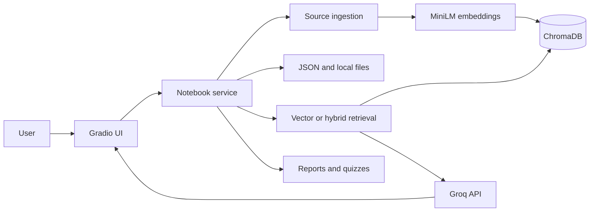

# Architecture

## Overview



The Gradio interface uses one service layer that connects ingestion, storage, retrieval, answer generation, and artifacts.

## Main modules

| File | Purpose |
| --- | --- |
| `app.py` | Gradio interface and user actions |
| `notebooklm/service.py` | Connects the application features |
| `notebooklm/ingest.py` | Extracts text, creates chunks, and indexes them |
| `notebooklm/vector_store.py` | Stores and queries embeddings in ChromaDB |
| `notebooklm/retrieval.py` | Runs vector and hybrid retrieval |
| `notebooklm/generation.py` | Generates grounded answers and artifacts |
| `notebooklm/storage.py` | Stores notebook records, chats, and artifact records as JSON |

## Data flow

1. The user creates a notebook and adds a file or URL.
2. Text is extracted and divided into overlapping chunks.
3. MiniLM creates embeddings for the chunks.
4. ChromaDB stores the chunks, embeddings, and citation metadata.
5. JSON files store notebook, source, chat, and artifact records.
6. Retrieval returns the top chunks from the selected notebook.
7. Groq generates an answer using only those chunks and includes citation markers.
8. Reports and quizzes are saved as downloadable Markdown files.

## Storage

```text
data/
├── notebooks.json
├── notebooks/
│   └── <notebook-id>.json
├── chroma/
├── sources/
│   └── <notebook-id>/
└── artifacts/
    └── <notebook-id>/
```

ChromaDB is the vector database. The JSON files contain notebook records, extracted source text, chat history, and artifact records. Uploaded files and generated artifacts are organized by notebook ID.

## Design choices

- ChromaDB performs persistent cosine vector search.
- `all-MiniLM-L6-v2` creates embeddings locally.
- Hybrid retrieval combines Chroma results with keyword ranking.
- Every chunk includes notebook, source, and chunk metadata for citations.
- GitHub Actions runs tests before deploying to Hugging Face Spaces.

## Limitations

The public application does not have user accounts, so visitors share the stored notebooks. Space storage may be cleared during a rebuild or restart, so the deployment should only be used with non-sensitive documents.
