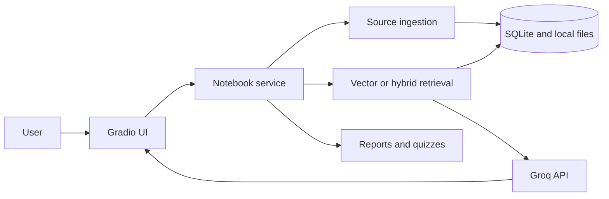

# Architecture

## Overview



The Gradio interface calls the notebook service, which connects ingestion, storage, retrieval, answer generation, and artifact creation.

## Main modules

| File | Purpose |
| --- | --- |
| `app.py` | Gradio interface and user actions |
| `notebooklm/service.py` | Connects the application features |
| `notebooklm/ingest.py` | Extracts text and creates overlapping chunks |
| `notebooklm/retrieval.py` | Creates embeddings and runs vector or hybrid search |
| `notebooklm/generation.py` | Sends retrieved context to Groq and creates artifacts |
| `notebooklm/storage.py` | Stores notebooks, sources, chunks, chats, and artifacts |
| `scripts/evaluate.py` | Compares the two retrieval methods |

## Data flow

1. The user creates a notebook and adds a file or URL.
2. The ingestion module extracts the text and divides it into overlapping chunks.
3. MiniLM creates an embedding for each chunk. The text, metadata, and vectors are saved in SQLite.
4. When the user asks a question, the selected retrieval method returns the top three chunks from that notebook.
5. Groq receives only those chunks and generates an answer with citation markers such as `[S1]`.
6. Chat history and generated reports or quizzes are saved under the same notebook.

## Storage

```text
data/
├── notebooklm.db
├── sources/
│   └── <notebook-id>/
└── artifacts/
    └── <notebook-id>/
```

SQLite stores the application records and embeddings. Uploaded files and generated Markdown artifacts are organized by notebook ID.

## Design choices

- `all-MiniLM-L6-v2` runs locally and creates the embeddings.
- Vector retrieval handles semantic similarity.
- Hybrid retrieval adds keyword matching for names, dates, and exact terms.
- Source metadata is kept with every chunk so answers can show citations.
- GitHub Actions runs the tests before deploying to Hugging Face Spaces.

## Limitations

The public application does not have user accounts, so visitors share the same stored notebooks. Data on the Space may also be cleared when the application is rebuilt or restarted. The deployed application should only be used with non-sensitive documents.
